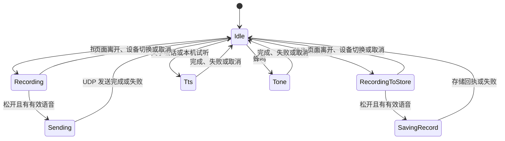
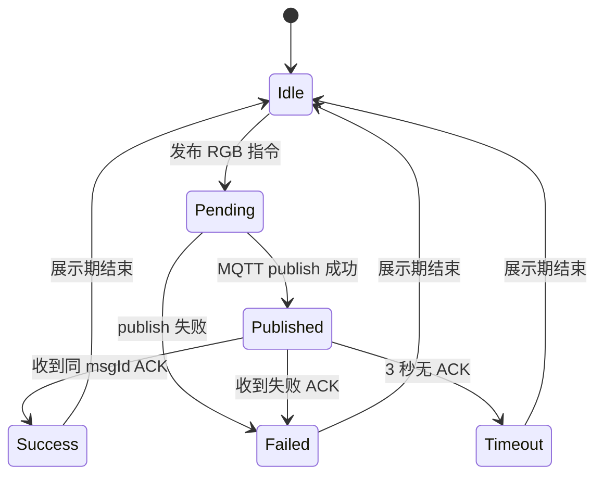
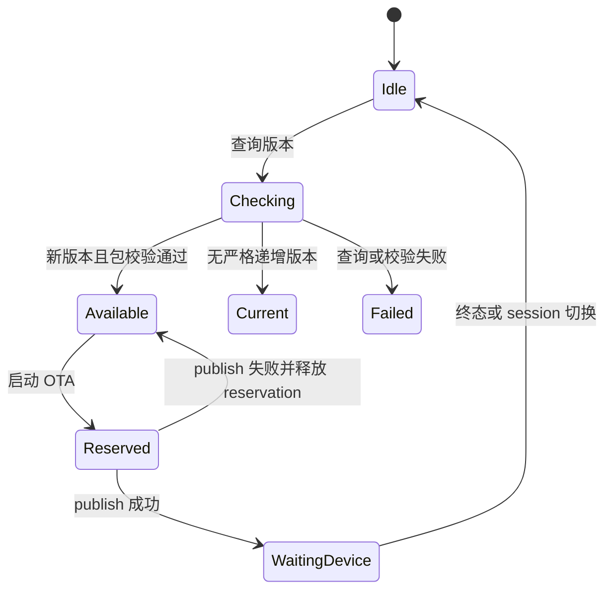

# ADR-004：产品控制状态机与页面任务生命周期

## 状态

- 状态：active
- 决策状态：已采纳
- 日期：2026-08-12

## 背景

Speaker、RadioDetection 和公共 OTA 页面当前都通过 Activity 的 `ViewModelStore` 获取 ViewModel。Compose
离开设备页只会移除界面，不会清除这些 ViewModel。因此，任何只在 `onCleared()` 中停止的采集、播放、轮询或请求，
都可能继续占用资源或把旧设备结果写回新页面。

本次重构必须保持现有 MQTT topic、payload、按钮位置、文案和设备行为不变。目标不是引入新的导航框架，
而是让已有状态机的任务所有权可执行、可测试。

## 现有公开行为基线

| 边界 | 公开状态/事件 | 外部命令 | 必须约束的副作用 |
| --- | --- | --- | --- |
| Speaker | `devices`、`feedback`、`talkState`、`mcuMicrophoneState`、音质/增益/TTS voice | stop、volume、servo、status、record CRUD、TTS、tone、PTT、MCU mic | 麦克风采集、UDP media、TTS preview、MQTT ACK 等待、MCU feedback 暂停/恢复、record event 收集 |
| RadioDetection | `devices`、`rgbFeedback`、RID replay | replay RID、RGB preview/save | RID replay 写回、RGB publish/ACK timeout、目标 TTL prune、device ACK 收集 |
| OTA | `otaCheckState`、`commandFeedback`、runtime OTA status | device info、check、start OTA | HTTP 查询、MQTT publish callback、每设备 start reservation、晚到请求过滤 |

### Speaker 状态机

约束：同一时刻只能有一个 PTT 目标；直接喊话固定 48 kHz；保存录音使用当前输出音质；
若采集前暂停了 MCU 麦克风反馈，结束、取消和失败都必须恢复同一设备的反馈。

### RadioDetection 状态机

约束：只允许当前 msgId 改写反馈；页面未绑定时不运行目标清理循环；离开页面后旧 ACK、timeout
和 replay 不得改变下一设备的可见状态。

### OTA 状态机

约束：查询结果必须同时匹配 session generation、device key 和最新 request id；设备/账号切换取消查询并
清空 UI；同设备 OTA reservation 只允许一个，仅终态、发布失败或 session 切换释放。普通离页不能释放，
否则用户返回页面可能重复下发 OTA。

## 决策

1. 三个 ViewModel 继续作为 UI 稳定 facade，现有公开 `StateFlow` 和方法名不变。
2. 有独立生命周期的工作拆入协调器：Speaker PTT/传输、Radio RGB/目标维护、OTA 查询/启动。
3. 产品页增加显式 `bindDevice`/`unbindDevice`（或等价接口）。Compose `DisposableEffect` 负责进入绑定、
   离开解绑；解绑必须幂等并立即停止该页面拥有的任务。
4. 任何异步结果提交前都校验 session generation 与 device key。只在入口检查不算完成。
5. Repository 继续承载进程会话内的设备真值；页面协调器不复制账号会话，不引入新的全局状态。
6. 每次只移动一个职责，先运行状态机测试和 payload golden tests，再继续下一个职责。

## 影响与取舍

- Activity 重建仍能复用设备仓库，但页面任务不再依赖 Activity `onCleared()` 才停止。
- 保留当前单 Activity/手工 DI，避免为了生命周期引入 Navigation/Hilt 的一次性大迁移。
- ViewModel 仍可能在 Activity 内存中保留少量无任务状态；这是可接受的空间换取低风险兼容。
- 若未来正式引入 Navigation，再将相同 facade 挂到 nav graph owner，不改变协调器契约。

## 未采用方案

- 一次性把每个产品拆成 Gradle feature：改动面会同时覆盖路由、DI、资源和协议，无法证明业务不变。
- 只依赖 `onCleared()`：Activity 不销毁时页面任务不会结束。
- 给每个设备永久创建 ViewModel key：能隔离状态，但会让实例随访问设备数累积，且仍未解决离页停止。
